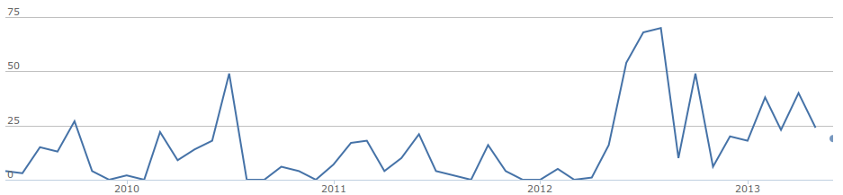
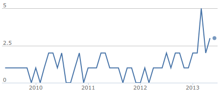

% Using Sumatra to Manage Numerical Simulations
% Daniel Wheeler
% June 27, 2013

## Context

 - Materials Genome Initiative - digital data, experimental data, computational tools
 - FiPy - Finite Volume PDE solver in Python
 - Materials Science research 

<!-- 
<iframe width="560" height="410" src="manufact_goal15.png" frameborder="0"> </iframe>
 -->

<!--  -->

## Automate

 <i>"Automate away ability to make dumb
mistakes. Don't use human based process."</i>, 
Tim Clem, Github, SciPy 2012 

## Example

~~~~{.python .numberLines startFrom="9"}
print("read in sumatra logo")
img = mpimg.imread('sumatra_logo.png')

print("solve distance function")
img = skfmm.distance(2 * img[:,:,3] - 1)
~~~~

## Example

~~~~{.python .numberLines startFrom="9"}
print("read in sumatra logo")
img = mpimg.imread('sumatra_logo.png')

print("solve distance function")
img = skfmm.distance(2 * img[:,:,3] - 1)

print("solve diffusion equation")
v = arrayToCellVariable(img)
(fp.TransientTerm() == \
 fp.DiffusionTerm()).solve(v, dt=1.)
~~~~

## Example

## Example

Calculate distance function

 

## Example

Calculate distance function

 

Apply some diffusion 

 

## A Workflow

~~~~{.console}
$ python script.py
read in sumatra logo
solve distance function
solve diffusion equation
$ edit script.py ## Change coeff
$ python script.py --coeff 10.0
read in sumatra logo
solve distance function
solve diffusion equation with coeff 10.0
~~~~

## A Workflow

~~~~{.console}
$ python script.py
read in sumatra logo
solve distance function
solve diffusion equation
$ edit script.py ## Change coeff
$ python script.py --coeff 10.0
read in sumatra logo
solve distance function
solve diffusion equation with coeff 10.0
~~~~

No history.

## A Workflow

~~~~{.console}
$ python script.py
read in sumatra logo
solve distance function
solve diffusion equation
$ edit script.py ## Change coeff
$ python script.py --coeff 10.0
read in sumatra logo
solve distance function
solve diffusion equation with coeff 10.0
~~~~

No history.

Invent a scheme for version
control.

##  Version Control

##  Version Control

History

~~~~{.console}
$ git log
c22025272e14 Change diffusion coeff
8c0b0e6d95ab Add distance function
~~~~

##  Version Control

History

~~~~{.console}
$ git log
c22025272e14 Change diffusion coeff
8c0b0e6d95ab Add distance function
~~~~

Query history

~~~~{.console}
$ git diff 8c0b0..c2202
-print("solve diffusion equation")
+print("solve diffusion equation with coeff=%s"\
+      % str(coeff))
- fp.DiffusionTerm()).solve(v, dt=1.)
+ fp.DiffusionTerm(coeff)).solve(v, dt=1.)
~~~~

## Simulation Management

## Simulation Management

~~~~{.console}
$ python script.py --coeff 20.0 ## no record
read in sumatra logo
solve distance function
solve diffusion equation with coeff 20.0
~~~~

## Simulation Management

~~~~{.console}
$ python script.py --coeff 20.0 ## no record
read in sumatra logo
solve distance function
solve diffusion equation with coeff 20.0
~~~~

Invent a scheme for recording simulations.

## Simulation Management

~~~~{.console}
$ python script.py --coeff 20.0 ## no record
read in sumatra logo
solve distance function
solve diffusion equation with coeff 20.0
~~~~

Invent a scheme for recording simulations.

~~~~{.console}
$ ## record event
$ git co -b sim0
$ edit script.py
$ python script.py --coeff 20.0 > stdout
$ git add stdout script.py data.txt
$ git ci -m "Add output for coeff 20"
~~~~

## Simulation Management

~~~~{.console}
$ python script.py --coeff 20.0 ## no record
read in sumatra logo
solve distance function
solve diffusion equation with coeff 20.0
~~~~

Invent a scheme for recording simulations.

~~~~{.console}
$ ## record event
$ git co -b sim0
$ edit script.py
$ python script.py --coeff 20.0 > stdout
$ git add stdout script.py data.txt
$ git ci -m "Add output for coeff 20"
~~~~

Version control is not designed to record simulation events.

## Sumatra

## Sumatra

Create a Sumatra repository.

~~~~{.console}
$ smt init sumatrademo
Sumatra project successfully set up
$ smt configure --executable=python \
> --main=script.py
~~~~

## Sumatra

Create a Sumatra repository.

~~~~{.console}
$ smt init sumatrademo
Sumatra project successfully set up
$ smt configure --executable=python \
> --main=script.py
~~~~

Run a simulation using Sumatra.

~~~~{.console}
$ smt run --reason "No diffusion" \
> default.param coeff=0.0 ## python script.py...
...
Data keys are [sumatra_contour_logo.png(a4c84...]
Created Django record store using SQLite
~~~~

## Sumatra

## Sumatra

View a record.

## Sumatra

View a record.

~~~~{.console}
$ smt list --long
----------------------------------------------
Label            : a87041629054
Timestamp        : 2013-06-21 12:01:04.0892...
Reason           : No diffusion
Duration         : 0.56453704834
Repository       : GitRepository at /home/w...
Main_File        : script.py
Version          : c18ed2276514bb29d233d4a9...
Parameters       : coeff = 0
Output_Data      : data.txt(d857eb69dd4f58...
User             : Daniel Wheeler <daniel.w...
~~~~

## Web Interface

<!-- "smtweb --allips --no-browser -p 8001" -->

 <http://localhost:8001/scipydemo/> 

## Commits Per Month

## Contributors Per Month

## Andrew Davison

## Andrew Davison

 

- Based at CNRS

- Leads a neuroinformatics group

- Models neuronal networks

- Promotes reproducible research in neuroscience

- PyNN, NineML and NeuroML, Sumatra, Neo and Helmholtz project

- Eats his own dog food

## Issues

 

 - Concurrency (fixed with Postgres instead of SQLite)   
 - Live inspection (kill, suspend and restart)   
 - Parallel, distributed, SGE   
 - Housekeeping (better documentation, DRY principle, more tests)   

## Active Research Example 

<http://localhost:8002/extremefill/>

<!-- <\!-- 
<iframe width="100%" height="80%"  allowfullscreen seamless src="http://129.6.153.60:8000/extremefill/" frameborder="0" border="0"> </iframe>
 -\\-> -\-> -->

## IPython Notebook 

<!-- 
 <http://localhost:7000> 
 -->

<iframe width="100%" height="80%"  allowfullscreen seamless src="http://localhost:7000" frameborder="0" border="0"> </iframe>
 -->

## Blog

<iframe width="100%" height="80%" allowfullscreen seamless src="http://localhost:4000/2013/05/07/extremefill2d/" frameborder="0" border="0"> </iframe>

## API

~~~~{.python .numberLines}
import sumatra as smt
import time
## create record
project = smt.load_project()
record = project.new_record(parameters, ...)
record.datastore.root = '/path/to/data'
## run simulation
runMySimulation(parameters,
                record.datastore.root)
## save record
record.output_data = \
    record.datastore.find_new_data()
project.add_record(record)
project.save()
~~~~

## Future Work

 - Live inspection (kill, suspend and restart)   
 - Testing (close integration with Buildbot)   
 - Distributed   

## Conclusion

## Conclusion

 

 - Sumatra is a lightweight system for recording simulation events.
 
 - No significant changes required to a typical command line workflow.

 - Search: "python sumatra"

## Slides

 - http://github.com/wd15/scipy2013
  

 
